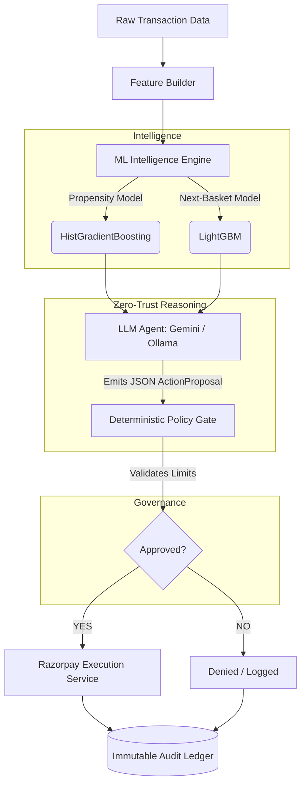

# Aegis: Technical Architecture & System Specification

## 1. System Overview & Zero-Trust Architecture

Aegis is a production-ready, fully-governed AI Commerce Agent designed to operationalize autonomous commercial decision-making (e.g., generating Razorpay payment links and discounts) without risking runaway costs, policy violations, or prompt injection exploits.

The system enforces a strict **four-layer structural separation**:
1. **Quantitative Intelligence**: Predictive ML models (Propensity & Re-ranking).
2. **Reasoning Node**: Generative AI (LLM) isolated from network/execution.
3. **Authorization**: Deterministic Python Policy Gate.
4. **Execution & Audit**: Razorpay API and Immutable SQLite Ledger.



---

## 2. Machine Learning Intelligence Pipeline

The reasoning agent is grounded by pre-computed deterministic signals to prevent LLM hallucinations regarding numerical likelihoods.

### 2.1. 30-Day Purchase Propensity Model (`next_purchase_30d`)
Computes the probability of a customer making a purchase in the next 30 days.

*   **Algorithm**: `sklearn.ensemble.HistGradientBoostingClassifier`
*   **Target**: `TARGET_next_purchase_30d` (binary in $(T, T+30]$)
*   **Features**: 19 temporal features (e.g., `recency_days`, `purchase_frequency`, `order_count_90d`). Strictly bounded to $\le T$ to prevent temporal leakage.
*   **Holdout Test Set Metrics**:
    *   **ROC-AUC**: 0.8191
    *   **PR-AUC**: 0.5627
    *   **Precision**: 72.17% (Optimized for high-precision targeting)
    *   **Recall**: 28.57%
    *   **F1 Score**: 0.4093
    *   **Accuracy**: 85.35%
    *   **Lift @ Top 10%**: 3.648x

### 2.2. Next-Basket Product Recommendation Model (`next_basket`)
Reranks candidate items to determine specific products the customer is likely to repurchase.

*   **Algorithm**: `lightgbm.Booster`
*   **Features**: 21 leakage-corrected features (e.g., `user_reorder_rate`, `user_product_avg_gap`).
*   **Holdout Test Set Metrics (@ Top 10)**:
    *   **NDCG@10**: 0.5244
    *   **Recall@10**: 0.5343
    *   **Precision@10**: 0.2989
    *   **MAP@10**: 0.3541

---

## 3. Generative Reasoning Engine (LLM)

The LLM acts purely as a reasoning node. It has **zero network access**, cannot execute SQL, and cannot invoke payments directly. It receives the ML context and proposes an action.

*   **Primary Model**: `Gemini 3.1 Pro` / `gemini-2.0-flash`
*   **Local Fallback**: `Ollama` (`llama3.2:3b`) running in strict JSON schema mode for 503/429 mitigation.
*   **Output Schema (`ActionProposal`)**:
    ```python
    class ActionProposal(BaseModel):
        intent: str                   # e.g., 'CREATE_WINBACK_OFFER'
        customer_id: str              # Customer identifier
        policy_rule_id: str           # e.g., 'WINBACK_01'
        reasoning_summary: str        # Grounded explanation
        requested_discount_pct: float # e.g., 15.0
        confidence: str               # 'High', 'Medium', 'Low'
        action_type: str              # 'CREATE_PAYMENT_LINK'
    ```

---

## 4. Deterministic Policy Gate & Governance

Treats the LLM `ActionProposal` as an **untrusted request**. Enforces hardcoded financial limits.

### 4.1. Hard Bounds (Execution Blocking)
*   **`MAX_DISCOUNT_PCT`**: 25.0% (Proposals $> 25\%$ are immediately denied).
*   **`MAX_PAYMENT_AMOUNT_INR`**: 2000 INR (Transaction ceiling).
*   **`REQUIRED_CONFIDENCE`**: Minimum "Medium".

### 4.2. Rule Priority Matrix
Evaluates the customer's state against their historical baseline to authorize intents:
1.  **`WINBACK_01` (Priority 100)**: `Segment = Dormant Multi-Buyers` + `recency_elevated (>= 2.0x)` $\to$ `CREATE_WINBACK_OFFER`
2.  **`NURTURE_01` (Priority 80)**: `Segment = Recent Repeat Buyers` + `spend_declining (<= 0.70x)` $\to$ `TARGETED_NURTURE`
3.  **`RETAIN_01` (Priority 70)**: `Segment = Active High-Value` + `frequency_declining (<= 0.50x)` $\to$ `RETENTION_OFFER`

---

## 5. Immutable Audit Ledger & Execution

All actions and state transitions are cryptographically tracked to ensure auditability of the autonomous agent.

*   **Database**: SQLite WAL Mode (`backend/data/aegis.db`)
*   **Idempotency**: Razorpay link requests pass `reference_id = action_id`, ensuring network retries cannot result in double-charges.
*   **Table: `audit_ledger`**
    *   Tracks: `event_type` (`PROPOSAL_GENERATED`, `POLICY_APPROVED`, `EXECUTION_SUCCESS`), `actor`, `status`.
    *   Secured via SHA-256 integrity checks.
*   **Reconciliation Engine**: Asynchronous polling/webhook syncing with the Razorpay API to update local `action_execution` states (`paid`, `expired`, `cancelled`).

---

## 6. API & Service Architecture

Powered by a unified **FastAPI** backend (14 endpoints) serving a frontend Streamlit operator console.

### Key Endpoints:
*   `GET /aegis/intelligence/{customer_id}`: End-to-end diagnostic ML pipeline inference output.
*   `POST /aegis/reactivate`: Triggers the complete autonomous loop (Intelligence $\to$ LLM Propose $\to$ Gate $\to$ Razorpay $\to$ Audit).
*   `GET /aegis/audit/{customer_id}`: Fetches chronological immutable audit trail.
*   `POST /aegis/reconcile`: Triggers the payment status reconciliation loop with Razorpay.
*   `POST /datasets/activate`: Activates imported CSV datasets (`replace`, `merge`, `new`).
